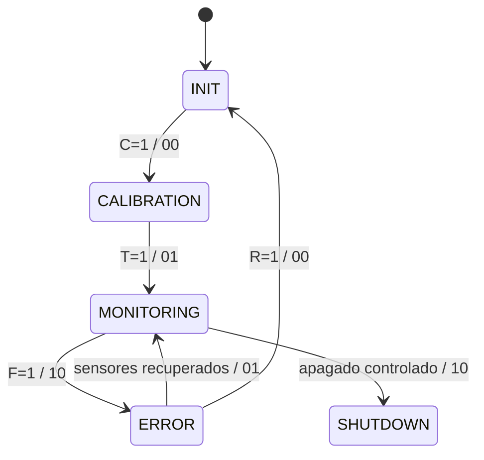
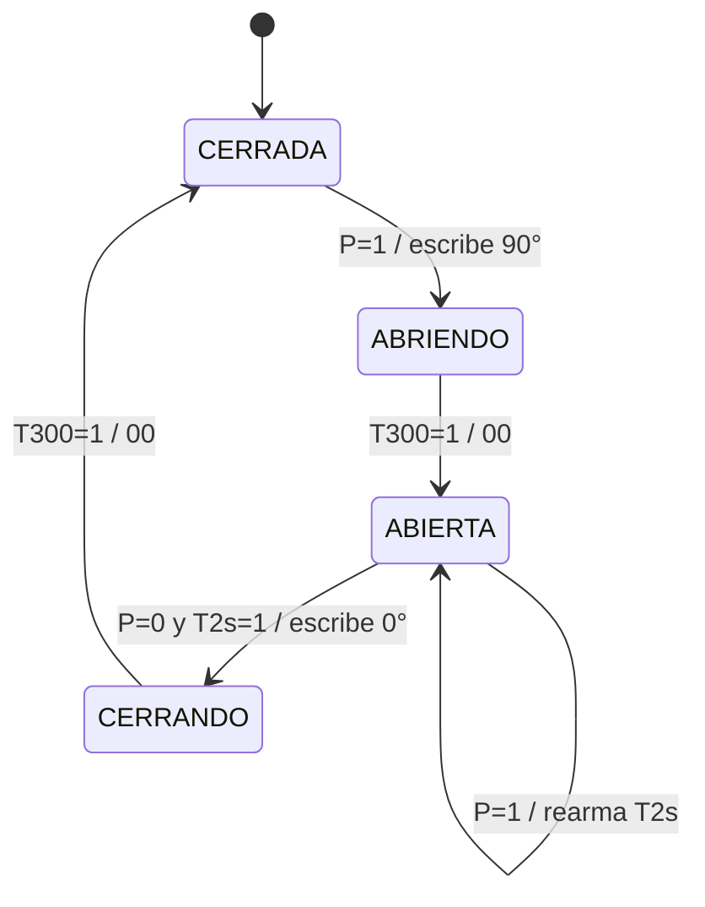
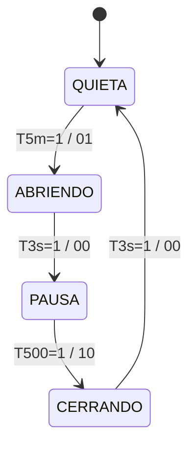
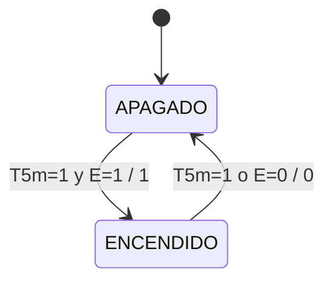

# 🏗️ Arquitectura Técnica — Galpón Inteligente (AVÍSENS · Nodo IoT)

Documento de diseño arquitectónico del firmware ESP32 para la automatización del galpón avícola.

> **Documento rector:** [`sdd_avisens.md`](../sdd_avisens.md) (SDD — Enfoque Edge & MQTT).
> Ante cualquier discrepancia entre este documento y el SDD, **prevalece el SDD**.
> Este archivo describe cómo se materializa esa especificación en el firmware y, donde
> todavía no coincide, lo declara explícitamente en [§1.3](#13-estado-de-implementación-frente-al-sdd).

---

## 1. Introducción Arquitectónica

### 1.1 Objetivos de Diseño

✅ **Modularidad**: Cada componente es independiente y reutilizable  
✅ **No-bloqueante**: Operación en tiempo real con FreeRTOS  
✅ **Robustez**: Fail-safe automático ante fallos de sensores  
✅ **Autonomía**: El lazo de control local sigue operando sin red (SDD §5.2)  
✅ **Escalabilidad**: Fácil agregar nuevos sensores/actuadores  
✅ **Mantenibilidad**: Código limpio y documentación desacoplada (SDD §8)

### 1.2 Decisiones Clave

| Decisión | Razón | Trade-off |
|----------|-------|-----------|
| **Dos cores** | Core 1 para sensores/actuadores críticos, Core 0 para red | El driver Wi-Fi del SDK ocupa el core 0; el control no puede compartirlo |
| **Máquinas de Estado** | Eliminar bloqueos, control predecible | Más código, más estados |
| **Filtro media móvil** | Reducir ruido en sensores analógicos | Latencia de 10 muestras |
| **Watchdog Timer** | Detectar bloqueo de la tarea de control | Reinicio forzado si no responde |
| **Histéresis en bomba** | Evitar oscilación ON/OFF continua | Rangos separados (6 cm vs 3 cm) |
| **MQTT (objetivo)** | Push de comandos, LWT, QoS 1 — SDD §6 | Requiere broker; migración pendiente |

### 1.3 Estado de Implementación frente al SDD

El SDD define el sistema objetivo. El firmware actual (**v9.0**, migración a MQTT + colas entre
cores) todavía no lo cumple en varios puntos. Esta tabla es la lista de trabajo pendiente, no una
descripción del sistema terminado. Cada fila apunta a la sección del SDD que la exige y al módulo
que la implementa (o debería).

| Área | SDD (objetivo) | Firmware actual | Estado |
|---|---|---|---|
| **Transporte** | MQTT v3.1.1/5.0, QoS 1, LWT (§6) | MQTT sobre PubSubClient (`ClienteMQTT`) | ⚠️ Publicación en QoS 0 |
| **Comandos** | Push por suscripción `actuadores/{a}/set` | Suscripción con comodín, QoS 1 | ✅ Cumple |
| **Presencia online** | LWT retenido en `status/lwt` | Armado en el CONNECT | ✅ Cumple |
| **Notificación de fallos** | En `telemetria/diagnostico` (§7.2) | Tópico propio `telemetria/eventos` (ICD §4.7) | ⚠️ Divergente, acordado en el ICD |
| **Sincronización entre cores** | — | Colas FreeRTOS, sin objetos compartidos | ✅ Cumple |
| **Control térmico** | PID discreto + anti-windup + PWM 10 s (§5.1) | Umbrales ON/OFF (bang-bang) en `GestorActuadores` | ❌ Pendiente |
| **Setpoints remotos** | `actuadores/config/pid`, persistidos en NVS | Constantes en `config.h`, sin NVS | ❌ Pendiente |
| **Debounce presencia** | 50 ms continuos (§4.2) | `SensorKY032` exige `KY032_DEBOUNCE_MS` de nivel estable; se muestrea cada 10 ms | ✅ Cumple (sin validar en hardware) |
| **Sensor trabado** | Alarma si presencia LOW > 120 s (§7.2) | `enTrabado()` tras `KY032_TRABADO_MS`; la puerta recibe «sin presencia» y se emite `PresenciaTrabada` en `telemetria/eventos` | ✅ Cumple (sin validar en hardware) |
| **Celda de carga** | Librería HX711 (bogde), 5 muestras con descarte de extremos, tara y factor en NVS (§4.2) | Bit-banging propio (bits y signo corregidos, `HX711_TIMEOUT_MS`), promedio simple, tara solo por `TARA` serie | ⚠️ Divergente; requiere recalibración |
| **Fail-safe y modo MANUAL** | §7.3 | `failSafe()` devuelve los cuatro relés a AUTO; comandos descartados en `ERROR`/`SHUTDOWN` | ✅ Cumple |
| **Lectura inválida en el lazo** | Nunca actuar sobre dato no válido (§7.2) | Se arrastra la última lectura buena; sin lectura previa el sensor entra en error | ✅ Cumple |
| **Lectura inválida en telemetría** | — | Se publica el último valor bueno; `sensor_ok` / `estado_sensor` es la única señal de frescura | ⚠️ Conocido, deliberado |
| **Detección de fallo MQ-135 / KY-032** | Solo DHT22 y HC-SR04 son críticos (§7.2) | `valida` fijo en `true`; un sensor desconectado lee un valor plausible y no alimenta el fail-safe | ⚠️ Sin detección |
| **FSM global** | INIT → CALIBRATION → MONITORING → ERROR | `ACTUATION` y `SHUTDOWN` existen pero ninguna transición los alcanza | ⚠️ Estados inalcanzables |
| **Periodo de las FSM de actuadores** | Avance cada ciclo de control (10 ms) | La puerta ya avanza a 10 ms junto con el KY-032; persiana y alimentador siguen dentro del bloque de sensores (`INTERVALO_SENSORES`, 2 s), por lo que `PAUSA_PERSIANA` (500 ms) se redondea a 2 s | ⚠️ Parcial |
| **Ciclo del alimentador** | — | `DURACION_ALIMENTO == INTERVALO_ALIMENTO == 5 min`: el sinfín gira la mitad del tiempo | ⚠️ Pendiente validar en banco |
| **Gradiente térmico abrupto** | — | `DetectorGradiente` solo registra en log, sin acción | ℹ️ Fuera del SDD |
| **Filtro MQ-135** | Media móvil 10 muestras (§4.2) | `MovingAverage<int,10>` | ✅ Cumple |
| **Watchdog 10 s** | §7.1 | `esp_task_wdt_init(10, true)`, solo `tareaControl` suscrita | ✅ Cumple |
| **Autonomía sin red** | Control local sigue activo (§5.2) | Core 1 es independiente de Core 0 | ✅ Cumple |
| **Comentarios mínimos** | §8.2 prohíbe bloques largos | Sin Doxygen en `.h`; solo notas de hardware en `.cpp` | ✅ Supera |
| **Carpeta `docs/`** | 5 manuales externos (§8.3) | Los cinco manuales más un índice de cobertura | ✅ Cumple |

Los defectos corregidos en la última pasada (DHT inválido entrando como `0.0 °C`, HX711 con bits
invertidos y sin signo, MANUAL sobreviviendo al fail-safe, HC-SR04 relabelando lecturas viejas
como `OK`, `SHUTDOWN` reejecutando `failSafe()` cada 10 ms, `modo` sensible a mayúsculas) fueron
verificados **solo por compilación**; ninguno tiene validación en hardware todavía.

#### Subsistemas incorporados al SDD

Tres subsistemas del galpón físico no figuraban en la primera versión del SDD y ya están
especificados en él (pinout §4.1, funcionalidades §2.2 y contrato MQTT §6.2):

| Subsistema | Módulo | Función | Literal MQTT |
|---|---|---|---|
| **Puerta automática** | `ControlServo` | Servo + KY-032 | `puerta` |
| **Persiana** | `Persiana` | L293D canal A | `persiana` |
| **Bomba de agua (K4)** | `GestorActuadores` | HC-SR04 + histéresis | `bomba` |

El SDD §4.1 asignaba **GPIO 14 al alimentador** cuando en el hardware real es el relé
**K4 (bomba de agua)**, con el alimentador en el canal B del L293D (GPIO 21/22/23).
Corregido: la tabla de pinout del SDD deriva ahora de `include/config.h`.

### 1.4 Mapa de Hardware Real (`include/config.h`)

| Componente | GPIO | Modo | Notas |
|---|---|---|---|
| DHT22 | 4 | Digital one-wire | Temp/humedad |
| MQ-135 | 34 | ADC1 (solo entrada) | Gases NH₃/CO₂ |
| HC-SR04 TRIG | 13 | Salida | Nivel de agua |
| HC-SR04 ECHO | 35 | Entrada (solo entrada) | Requiere divisor 5 V → 3.3 V |
| KY-032 | 33 | Entrada `INPUT_PULLUP` | LOW = presencia |
| HX711 DT | 15 | Entrada | ⚠️ Pin de strapping (MTDO) |
| HX711 SCK | 16 | Salida | — |
| **K1** Calefacción | 32 | Salida (activo en LOW) | Relé optoacoplado |
| **K2** Ventilador | 25 | Salida (activo en LOW) | Literal MQTT `ventilador` |
| **K3** Extractor | 27 | Salida (activo en LOW) | — |
| **K4** Bomba de agua | 14 | Salida (activo en LOW) | — |
| Persiana EN1/IN1/IN2 | 5 / 18 / 19 | L293D canal A | — |
| Alimentador EN2/IN3/IN4 | 21 / 22 / 23 | L293D canal B (PWM) | Motor sinfín |
| Servo puerta | 2 | PWM | ⚠️ Pin de strapping / LED de boot |

---

## 2. Capas Arquitectónicas

```
┌────────────────────────────────────────────────────────┐
│  Capa de Aplicación                                    │
│  ├─ main.cpp          setup(), loop()                  │
│  ├─ Nodo              instancias globales y arranque   │
│  ├─ TareaControl      lazo de Core 1, watchdog         │
│  ├─ TareaRed          lazo de Core 0, cadencias        │
│  ├─ SistemaFSM        máquina de estado global         │
│  ├─ Mensajeria        colas y buzones entre cores      │
│  ├─ ConsolaSerie      TARA / REARME                    │
│  └─ DetectorGradiente ΔT abrupto                       │
└────────────────────────────────────────────────────────┘
         ↓
┌────────────────────────────────────────────────────────┐
│  Capa de Comunicación (ClienteMQTT)                    │
│  ├─ Telemetría periódica                               │
│  ├─ Recepción de comandos de actuador                  │
│  └─ Eventos de falla y diagnóstico                     │
└────────────────────────────────────────────────────────┘
         ↓
┌────────────────────────────────────────────────────────┐
│  Capa de Servicios (GestorActuadores)                  │
│  ├─ Lógica de control (umbrales → PID)                 │
│  ├─ Histéresis de bomba                                │
│  ├─ Arbitraje AUTO / MANUAL                            │
│  └─ Fail-safe coordinado                               │
└────────────────────────────────────────────────────────┘
         ↓
┌────────────────────────────────────────────────────────┐
│  Capa de Dispositivos (Sensores + Actuadores)          │
│  ├─ SensorDHT, SensorMQ135, SensorUltrasonico,         │
│  │  SensorKY032, SensorPeso                            │
│  ├─ ControlServo, Alimentador, Persiana                │
│  └─ Cada uno con su FSM privada                        │
└────────────────────────────────────────────────────────┘
         ↓
┌────────────────────────────────────────────────────────┐
│  Capa de Periféricos (GPIO, ADC, PWM)                  │
│  ├─ Pines ESP32, interfaces hardware                   │
│  └─ Filtrado digital (MovingAverage)                   │
└────────────────────────────────────────────────────────┘
```

---

## 3. Máquinas de Estado Finitas (Modelo Mealy)

En el modelo de Mealy, las salidas se generan a partir de la interacción entre el
**Estado Actual ($Q_t$)** y las **Entradas presentes ($X$)**, permitiendo una reacción
inmediata sin esperar al siguiente ciclo.

Notación en transiciones: **`Entradas (X) / Salidas (Y)`**

---

### 3.1 FSM del Sistema Global (`SistemaFSM`)

Coordina el ciclo de vida del microcontrolador, la tara inicial y el disparo del fail-safe.

**Variables de Entrada ($X$):**
* $C$: Contador de ciclos de arranque ($1$: $\ge 10$ ciclos, $0$: en proceso).
* $T$: Tara de celda HX711 completada o timeout ($1$: listo, $0$: pendiente).
* $F$: Fallos acumulados en sensores críticos ($1$: $\ge 3$ fallos, $0$: sensores OK).
* $R$: Comando de rearme manual por Serial ($1$: activo, $0$: inactivo).

**Salidas del Sistema ($Y_1 Y_0$):**
* $00$: Modo Configuración / Standby.
* $01$: Operación Normal (lazo cerrado de lectura y control activo).
* $10$: **Fail-Safe Activo** (K1-K3 apagados en `HIGH`; K4/bomba encendida en `LOW`).



| Estado Actual ($Q_1 Q_0$) | Entradas ($C, T, F, R$) | Estado Siguiente ($D_1 D_0$) | Salidas ($Y_1 Y_0$) | Acción FSM / Periféricos |
| :---: | :---: | :---: | :---: | :--- |
| **$S_0$: INIT (00)** | $0 - - -$ | **$S_0$ (00)** | **$00$** | Espera de estabilización del hardware. |
| **$S_0$: INIT (00)** | $1 - - -$ | **$S_1$ (01)** | **$00$** | Inicia rutina de tara para celda HX711. |
| **$S_1$: CALIB (01)** | $- 0 - -$ | **$S_1$ (01)** | **$00$** | Espera comando `TARA` o timeout de 15 s. |
| **$S_1$: CALIB (01)** | $- 1 - -$ | **$S_2$ (10)** | **$01$** | Tara finalizada $\rightarrow$ habilita lazo de control. |
| **$S_2$: MONIT (10)** | $- - 0 -$ | **$S_2$ (10)** | **$01$** | Muestreo cada 2 s y control de relés. |
| **$S_2$: MONIT (10)** | $- - 1 -$ | **$S_3$ (11)** | **$10$** | **Disparo de Fail-Safe:** desactiva K1-K3, activa K4. |
| **$S_3$: ERROR (11)** | $- - - 0$ | **$S_3$ (11)** | **$10$** | Mantiene actuadores en posición segura. |
| **$S_3$: ERROR (11)** | $- - - 1$ | **$S_0$ (00)** | **$00$** | Rearme del sistema por comando `REARME`. |

> ⚠️ **Desviación actual del código.** `setup()` fuerza `estadoSistema = MONITORING` al terminar,
> de modo que **INIT y CALIBRATION nunca se recorren** en un arranque normal. Además, la salida de
> CALIBRATION usa `ciclosTarea > 150`, un contador monótono global que ya vale miles tras un rearme,
> por lo que la transición es instantánea. Debe usarse un contador relativo a la entrada al estado.
> Los estados `ACTUATION` y `SHUTDOWN` son inalcanzables en el código actual.

---

### 3.2 FSM de Puerta (`ControlServo`)

Controla el servomotor de acceso según la detección de presencia del sensor infrarrojo KY-032.

El servo es **posicional**: se le escribe un ángulo absoluto y mantiene esa posición por par de
retención. No hay estado de "giro" ni posición neutra — la FSM solo temporiza el recorrido mecánico.

**Variables de Entrada ($X$):**
* $P$: Presencia detectada ($1$: detectada, $0$: despejado).
  *El KY-032 es activo en LOW; `SensorKY032` invierte el nivel del pin, aplica el antirrebote de
  `KY032_DEBOUNCE_MS` y entrega el booleano. Si el sensor está trabado (`enTrabado()`), `TareaControl`
  fuerza $P=0$ para que la puerta cierre y quede inhabilitada hasta que el pin se libere.*
* $T_{300}$: Timer de recorrido angular cumplido ($1$: $t \ge 300$ ms, $0$: $t < 300$ ms).
* $T_{2s}$: Timer de apertura mantenida cumplido ($1$: $t \ge 2000$ ms, $0$: $t < 2000$ ms).

**Salidas Mealy ($Y_1 Y_0$ — escritura al servo):**
* $00$: **Sin escritura** — el servo mantiene el ángulo actual.
* $01$: **Escribe $90^\circ$** (`ANGULO_ABIERTA`) — inicia apertura.
* $10$: **Escribe $0^\circ$** (`ANGULO_CERRADA`) — inicia cierre.



| Estado Actual ($Q_1 Q_0$) | Entradas ($P, T_{300}, T_{2s}$) | Estado Siguiente ($D_1 D_0$) | Salidas ($Y_1 Y_0$) | Acción Física del Servomotor |
| :---: | :---: | :---: | :---: | :--- |
| **$S_0$: CERRADA (00)** | $0 - -$ | **$S_0$ (00)** | **$00$** | Sin presencia $\rightarrow$ puerta mantenida en $0^\circ$. |
| **$S_0$: CERRADA (00)** | $1 - -$ | **$S_1$ (01)** | **$01$** | Presencia detectada $\rightarrow$ escribe $90^\circ$ y arranca el timer. |
| **$S_1$: ABRIENDO (01)** | $- 0 -$ | **$S_1$ (01)** | **$00$** | Recorrido mecánico en curso ($t < 300$ ms). |
| **$S_1$: ABRIENDO (01)** | $- 1 -$ | **$S_2$ (10)** | **$00$** | $300$ ms cumplidos $\rightarrow$ se da por abierta en $90^\circ$. |
| **$S_2$: ABIERTA (10)** | $1 - -$ | **$S_2$ (10)** | **$00$** | Presencia continua $\rightarrow$ **rearma** el timer de 2 s. |
| **$S_2$: ABIERTA (10)** | $0 - 0$ | **$S_2$ (10)** | **$00$** | Despejado, consumiendo los 2 s de gracia. |
| **$S_2$: ABIERTA (10)** | $0 - 1$ | **$S_3$ (11)** | **$10$** | $2$ s sin presencia $\rightarrow$ escribe $0^\circ$ y arranca el timer. |
| **$S_3$: CERRANDO (11)** | $- 0 -$ | **$S_3$ (11)** | **$00$** | Recorrido de retorno en curso ($t < 300$ ms). |
| **$S_3$: CERRANDO (11)** | $- 1 -$ | **$S_0$ (00)** | **$00$** | Cierre completado $\rightarrow$ puerta en reposo a $0^\circ$. |

**Constantes** (`include/ControlServo.h`, `include/config.h`):

| Constante | Valor | Significado |
|---|---|---|
| `ANGULO_CERRADA` | `0` | Puerta cerrada |
| `ANGULO_ABIERTA` | `90` | Puerta abierta |
| `SERVO_DURACION_GIRO` | `300` ms | Recorrido mecánico |
| `SERVO_TIEMPO_ABIERTA` | `2000` ms | Gracia antes de cerrar |
| `SERVO_PIN` | `2` | Señal PWM |

> ℹ️ `SERVO_NEUTRO` (93°) sigue declarado en `config.h` pero **no se usa**: es un resto del diseño
> anterior, que asumía un servo de rotación continua. Conviene eliminarlo.

> ⚠️ **Riesgo de seguridad animal.** El estado `CERRANDO` **no evalúa $P$**: si un ave entra durante
> la ventana de 300 ms de cierre, la puerta completa el recorrido igualmente. Una revisión futura
> debería permitir la reapertura desde `CERRANDO` ante $P=1$.

---

### 3.3 FSM de Persiana (`Persiana`)

Gestiona el ciclo de renovación de aire mediante el puente H L293D (canal A).

**Variables de Entrada ($X$):**
* $T_{5m}$: Temporizador de intervalo entre ciclos ($1$: $t \ge 5$ min, $0$: en espera).
* $T_{3s}$: Temporizador de recorrido mecánico ($1$: $t \ge 3$ s, $0$: en movimiento).
* $T_{500}$: Temporizador de pausa ($1$: $t \ge 500$ ms, $0$: en pausa).

**Salidas Mealy ($Y_1 Y_0$ — líneas L293D canal A $\{EN1, IN1, IN2\}$):**
* $00$: **Motor parado** (`EN1=0, IN1=0, IN2=0`).
* $01$: **Giro apertura** (`EN1=1, IN1=1, IN2=0`).
* $10$: **Giro cierre** (`EN1=1, IN1=0, IN2=1`).



| Estado Actual ($Q_1 Q_0$) | Entradas ($T_{5m}, T_{3s}, T_{500}$) | Estado Siguiente ($D_1 D_0$) | Salidas ($Y_1 Y_0$) | Estado Físico del Motor |
| :---: | :---: | :---: | :---: | :--- |
| **$S_0$: QUIETA (00)** | $0 - -$ | **$S_0$ (00)** | **$00$** | En reposo (espera de 5 minutos). |
| **$S_0$: QUIETA (00)** | $1 - -$ | **$S_1$ (01)** | **$01$** | Intervalo cumplido $\rightarrow$ inicia apertura. |
| **$S_1$: ABRIENDO (01)** | $- 0 -$ | **$S_1$ (01)** | **$01$** | Desplazamiento activo ($t < 3$ s). |
| **$S_1$: ABRIENDO (01)** | $- 1 -$ | **$S_2$ (10)** | **$00$** | Apertura completada $\rightarrow$ frena motor. |
| **$S_2$: PAUSA (10)** | $- - 0$ | **$S_2$ (10)** | **$00$** | Pausa para evitar picos de corriente inductiva. |
| **$S_2$: PAUSA (10)** | $- - 1$ | **$S_3$ (11)** | **$10$** | Pausa finalizada $\rightarrow$ inicia cierre. |
| **$S_3$: CERRANDO (11)** | $- 0 -$ | **$S_3$ (11)** | **$10$** | Desplazamiento de retorno activo ($t < 3$ s). |
| **$S_3$: CERRANDO (11)** | $- 1 -$ | **$S_0$ (00)** | **$00$** | Fin del recorrido $\rightarrow$ motor detenido. |

---

### 3.4 FSM del Tornillo Sinfín / Alimentador (`Alimentador`)

Controla la dosificación periódica de alimento accionando el canal PWM del L293D (canal B).

**Variables de Entrada ($X$):**
* $T_{5m}$: Temporizador de ciclo ($1$: $t \ge 5$ min, $0$: $t < 5$ min).
* $E$: Bandera de habilitación general ($1$: habilitado, $0$: bloqueado por seguridad o paro).

**Salida Mealy ($Y$ — L293D canal B $\{EN2, IN3, IN4\}$):**
* $0$: **Apagado** (`EN2=0, IN3=0, IN4=0`).
* $1$: **Encendido al 50 % PWM** (`EN2=128, IN3=1, IN4=0`).



| Estado Actual ($Q$) | Entradas ($T_{5m}, E$) | Estado Siguiente ($D$) | Salida ($Y$) | Acción del Sinfín |
| :---: | :---: | :---: | :---: | :--- |
| **$S_0$: APAGADO (0)** | $0 -$ | **$S_0$ (0)** | **$0$** | Espera de 5 minutos antes de volver a dispensar. |
| **$S_0$: APAGADO (0)** | $- 0$ | **$S_0$ (0)** | **$0$** | Dosificador bloqueado (deshabilitado externamente). |
| **$S_0$: APAGADO (0)** | $1 1$ | **$S_1$ (1)** | **$1$** | Ciclo activo $\rightarrow$ motor arranca al 50 % PWM. |
| **$S_1$: ENCENDIDO (1)** | $0 1$ | **$S_1$ (1)** | **$1$** | Sinfín dosificando ración ($t < 5$ min). |
| **$S_1$: ENCENDIDO (1)** | $1 -$ | **$S_0$ (0)** | **$0$** | Ración completada $\rightarrow$ motor detenido. |
| **$S_1$: ENCENDIDO (1)** | $- 0$ | **$S_0$ (0)** | **$0$** | Parada inmediata por desactivación de habilitación. |

---

## 4. Gestión de Sensores

### 4.1 DHT22 (Temperatura + Humedad)

```cpp
struct LecturaDHT {
  float temperatura;     // °C
  float humedad;         // % RH
  bool valida;
  unsigned long timestamp;
};
```

**Protocolo**: DHT (one-wire simplificado)  
**Validación**: `NaN` + rango físico ($-10$ a $60$ °C, $0$ a $100$ %)  
**Fiabilidad**: 3 fallos consecutivos $\rightarrow$ `enError() == true`  
**Acción en error**: Sistema entra en fail-safe

### 4.2 MQ-135 (Gases: NH₃/CO₂)

```cpp
struct LecturaMQ135 {
  int rawValue;          // 0-4095 (ADC 12-bit)
  float voltaje;         // 3.3 V máx
  bool valida;
  unsigned long timestamp;
};
```

**Filtrado**: Media móvil circular de 10 muestras (SDD §4.2)

**Niveles**:
  - NORMAL: < 800
  - MODERADO: 800 – 1499
  - ALTO: ≥ 1500

**Trigger**: Gas ALTO → Ventilación forzada (prioritaria sobre calefacción)

### 4.3 KY-032 (Sensor de Presencia)

```cpp
struct LecturaKY032 {
  bool presencia;        // true = detectado
  unsigned long timestamp;
};
```

**Lógica**: Pin activo en LOW. El nivel crudo debe mantenerse `KY032_DEBOUNCE_MS` (50 ms) sin
cambiar antes de aceptarse como `presencia`; el muestreo va en el bucle de 10 ms de `tareaControl`,
fuera del bloque de `INTERVALO_SENSORES`.  
**Uso**: Disparo de la puerta automática

**Sensor trabado (SDD §7.2)**: si la presencia estable dura más de `KY032_TRABADO_MS` (120 s),
`enTrabado()` pasa a `true`. `TareaControl` presenta entonces «sin presencia» a la puerta, que
cierra y queda inhabilitada, y encola un evento `PresenciaTrabada` (nivel `advertencia`) en
`telemetria/eventos`; al liberarse el pin se encola otro con nivel `info`. No entra en `ERROR`
global: es una alarma preventiva, no un fail-safe. El sensor sigue sin `enError()`: un módulo
desconectado lee `HIGH` (sin presencia), que es el estado seguro.

### 4.4 HC-SR04 (Nivel de Agua)

```cpp
struct LecturaUltrasonico {
  float distancia;       // cm
  EstadoSensorUltrasonico estado;
  unsigned long timestamp;
};
```

**Estados posibles**:
```cpp
enum class EstadoSensorUltrasonico : uint8_t {
  OK = 0,              // Lectura válida
  TIMEOUT = 1,         // Sin eco en 30 ms
  OUT_OF_RANGE = 2,    // > 400 cm o < 0.5 cm
  ERROR = 3            // Fallos acumulados ≥ 3
};
```

**Filtrado**: Media móvil de 10 muestras  
**Lógica de bomba**: Histéresis
  - Bomba ON si distancia > 6.0 cm (tanque bajo)
  - Bomba OFF si distancia ≤ 3.0 cm (tanque lleno)
  - En error: mantener último estado conocido

> ℹ️ Publicado en el tópico `telemetria/nivel_agua` (SDD §6.3-A).

### 4.5 HX711 (Celda de Carga / Tolva)

```cpp
struct LecturaPeso {
  float peso;            // gramos
  float voltaje;
  bool valida;
  unsigned long timestamp;
};
```

**Calibración**: tara manual por comando Serial `TARA`, factor de escala en `HX711_FACTOR_ESCALA`  
**Alerta**: peso < `UMBRAL_ALIMENTO_BAJO` (500 g)

> ⚠️ **Divergencia con el SDD.** El SDD (Apéndice B) especifica la librería **HX711 de bogde** y
> un muestreo de 5 lecturas con descarte de extremos (§4.2). El firmware implementa el protocolo
> a mano con promedio simple de 10 muestras. Además la tara no se persiste en NVS.

---

## 5. Gestión de Actuadores

### 5.1 Relés (K1-K4)

```cpp
class Actuador {
  void activar();     // GPIO = LOW  (relé activo)
  void desactivar();  // GPIO = HIGH (relé inactivo)
  bool getEstado();   // true = activo
};
```

> ℹ️ **Estado seguro = `HIGH`.** Con esta etapa de relés optoacoplados **`LOW` energiza la bobina**,
> de modo que la línea en reposo seguro es `HIGH`. El SDD §7.3 lo recoge así, junto con la
> exigencia de pull-ups externos para cubrir la ventana de arranque.

| Relé | Función física | Nombre en el contrato backend | Lógica de activación |
|------|---------|---|---|
| K1 | Calefacción / bombillos IR | `calefactor` | ON si `T < 27 °C` **y** gas no alto |
| K2 | Ventilador | `ventilador` | ON si K1 activo **o** hay ventilación |
| K3 | Extractor | `extractor` | ON si **no** hay calefacción **y** (`T ≥ 32 °C` **o** `H > 65 %` **o** gas alto) |
| K4 | Bomba de agua | `bomba` | ON si distancia > 6 cm (histéresis) |

> ℹ️ **Nota de nomenclatura.** El literal canónico de K2 en el SDD §6.3-B es `ventilador`,
> porque el galpón no tiene humidificador. `GestorActuadores::releDesdeNombre()` sigue aceptando
> `humidificador` como **alias en desuso** para no romper integraciones existentes; el backend
> debe migrar al nombre canónico y el alias podrá retirarse después.

**Arbitraje AUTO / MANUAL**: un relé puesto en MANUAL queda congelado en el valor enviado por la
app y `actualizar()` no lo sobrescribe, hasta recibir un comando en modo `AUTO`.

> ⚠️ **Defecto conocido.** `failSafe()` escribe los relés directamente sin consultar las banderas
> `manualK1_..K4_`, y esas banderas siguen en `true`. Al recuperarse el sensor, los relés que
> estaban en MANUAL quedan clavados en el estado de emergencia hasta recibir un comando `AUTO`.

### 5.2 Servo (Puerta)

```cpp
class ControlServo {
  void escribirServoCuidado(uint8_t angulo);
};
```

**Servo posicional de dos posiciones:**

| Posición | Ángulo | Constante |
|---|---|---|
| **Cerrada** (reposo) | $0^\circ$ | `ANGULO_CERRADA` |
| **Abierta** | $90^\circ$ | `ANGULO_ABIERTA` |

**Duración de giro**: 300 ms  ·  **Tiempo abierta**: 2000 ms  
**Alimentación**: 5 V (regulador externo recomendado; no alimentar desde el pin 5 V del ESP32)

> ⚠️ `SERVO_PIN = 2` es pin de strapping y LED de boot. Si el servo carga la línea durante el
> arranque puede impedir el boot. Se recomienda reubicarlo a un GPIO libre sin función de strapping.

### 5.3 Motor L293D (Persiana y Alimentador)

```
Canal A (EN1=5, IN1=18, IN2=19) — Persiana:
  ├─ IN1=HIGH, IN2=LOW  → Giro apertura
  ├─ IN1=LOW,  IN2=HIGH → Giro cierre
  └─ EN1=HIGH           → Habilitación

Canal B (EN2=21, IN3=22, IN4=23) — Alimentador:
  ├─ IN3=HIGH, IN4=LOW  → Giro del sinfín
  └─ EN2=PWM(128)       → 50 % de velocidad
```

---

## 6. Filtro de Media Móvil (MovingAverage)

### 6.1 Implementación

```cpp
template <typename T, uint16_t SIZE = 10>
class MovingAverage {
  T add(T value);      // Agrega valor, retorna promedio
  T getAverage() const;
  bool isFilled() const;
};
```

$$V_{\text{filtrado}} = \frac{1}{N} \sum_{i=0}^{N-1} V_{\text{raw}}[i]$$

### 6.2 Buffer Circular

```
Agregar valores: [v1, v2, v3, ..., v10]
Suma: v1+v2+...+v10        Promedio: Suma/10

Agregar v11:
  • Suma -= v1
  • Suma += v11
  • Índice = 1
  • Promedio: Suma/10
```

### 6.3 Aplicación

| Sensor | Buffer | Efecto |
|--------|--------|--------|
| MQ-135 | 10 | Estabiliza la lectura de gases |
| HC-SR04 | 10 | Elimina picos de distancia |

> ℹ️ La clase expone además `esPicoRuido()`, `calcularDesviacionEstandar()`, `getMin()` y `getMax()`,
> que actualmente **no se usan** en ningún módulo.

---

## 7. Watchdog Timer (WDT)

### 7.1 Configuración

```cpp
esp_task_wdt_init(WDT_TIMEOUT_S, true);  // 10 s, panic = true
esp_task_wdt_add(NULL);                  // Suscribe la tarea actual
esp_task_wdt_reset();                    // En cada ciclo
```

Solo `tareaControl()` (Core 1) está suscrita al WDT. `tareaRed()` no lo está, precisamente
porque sus operaciones de red pueden bloquear durante segundos.

### 7.2 Escenario de Fallo

```
Ciclo 1:  Reset WDT ✓
Ciclo 2:  [BLOQUEO EN TAREA] ✗
...
t = 10 s: TIMEOUT → panic → stack trace → reinicio
```

### 7.3 Prevención de Bloqueo

- **`vTaskDelay()`** en cada ciclo: cede el scheduler
- **`esp_task_wdt_reset()`** antes de operaciones largas
- **Nunca `delay()`** en tareas — siempre `vTaskDelay()`
- **Nunca E/S de red** dentro de la tarea suscrita al WDT

> ℹ️ **Regla firme.** Ninguna publicación se realiza desde `tareaControl`. Los eventos de falla se
> encolan en `colaEventos` y los publica `tareaRed`. Los actuadores se accionan **antes** de
> encolar nada, de modo que un broker lento no puede retrasar el fail-safe ni provocar un reinicio
> por watchdog.

---

## 8. Estrategia de Error (Fail-Safe)

### 8.1 Estados de Error por Sensor

```
Lectura OK
  ↓
Lectura ERR → Contador = 1
  ↓
Lectura ERR → Contador = 2
  ↓
Lectura ERR → Contador = 3 → enError() = true
              ↓
         Sistema → ERROR
              ↓
         failSafe()
```

### 8.2 Acciones en Fail-Safe

```cpp
void failSafe() {
  k1_.desactivar();      // Calefacción OFF
  k2_.desactivar();      // Ventilador OFF
  k3_.desactivar();      // Extractor OFF
  k4_.activar();         // Bomba ON

  controlServo.cerrarEmergencia();
  alimentador.detener();
  persiana.detener();
}
```

**Rationale**:
- Evitar sobrecalentamiento desactivando la calefacción
- Detener mecanismos móviles por seguridad
- Cerrar la puerta para contener a los animales

> ℹ️ Esta es la estrategia recogida en el SDD §7.2 y §7.3: apagar K1-K3, forzar la bomba,
> cerrar la puerta y detener persiana y sinfín. La recuperación es automática en cuanto los
> sensores críticos vuelven a entregar lecturas válidas.

> ℹ️ `failSafe()` se reaplica cada ciclo mientras dure la condición, pero su traza está guardada
> por flanco con `enFailSafe_`: los relés se reescriben siempre, el log sale una vez por episodio.

---

## 9. Distribución FreeRTOS

### 9.1 Core 1 (Sensores/Actuadores)

> ⚠️ **Por qué el control va en el core 1 y no en el 0.** La tarea del driver Wi-Fi del ESP32 está
> clavada en el **core 0** por el SDK (`CONFIG_ESP32_WIFI_TASK_CORE_ID`) y no se puede reubicar
> desde la aplicación; por eso Arduino-ESP32 deja el `loopTask` del usuario en el core 1. El reparto
> original de este firmware era el inverso y ponía `tareaControl` a competir con la radio: las
> interrupciones y los bloqueos de caché de flash durante el escaneo Wi-Fi corrompían los protocolos
> bit-bang del DHT22, el HC-SR04 y el HX711, que fallaban con `NaN` y `TIMEOUT` desde el arranque.
> `CORE_CONTROL` y `CORE_RED` se intercambiaron en `config.h` por ese motivo.


```
tareaControl() — Prioridad 2
  • Drenaje de comandos entrantes
  • Avance de la FSM global
  • Lectura de sensores (cada 2000 ms)
  • Control de actuadores
  • Publicación de snapshots a los buzones
  • Reset del Watchdog Timer

Stack: 16384 bytes (16 KB)
Período: 10 ms (vTaskDelay)
```

### 9.2 Core 0 (Red)

```
tareaRed() — Prioridad 1
  • Conexión y reconexión Wi-Fi
  • Sesión MQTT (mqtt_.loop) y reconexión al broker
  • Telemetría rápida 5 s, lenta 10 s, diagnóstico 60 s
  • Presencia y estado de actuadores por cambio
  • Recepción de comandos por suscripción

Stack: 8192 bytes (8 KB)
Período: 100 ms (vTaskDelay)
```

### 9.3 `loop()`

```
loop() — tarea Arduino por defecto
  • Vacío: solo vTaskDelay(1000)
  • Todo el trabajo vive en las dos tareas ancladas
```

### 9.4 Sincronización entre Cores

Core 1 posee sensores y actuadores; Core 0 posee la sesión de red. **Ningún objeto se comparte.**
Todo cruce copia una estructura por valor a través de una cola FreeRTOS, lo que elimina la
necesidad de mutex y el riesgo de lectura rota.

| Estructura | Tipo | Longitud | Productor | Consumidor |
|---|---|:---:|---|---|
| `buzonTelemetria` | `SnapshotTelemetria` | 1 | Core 1 | Core 0 |
| `buzonActuadores` | `EstadoActuadores` | 1 | Core 1 | Core 0 |
| `colaComandos` | `ComandoActuador` | 8 | Core 0 | Core 1 |
| `colaEventos` | `EventoFalla` | 4 | Core 1 | Core 0 |

Los buzones de longitud 1 usan `xQueueOverwrite`/`xQueuePeek` para estado continuo, donde solo
importa el último valor. Las colas FIFO transportan eventos discretos que deben procesarse una
sola vez. Detalle completo en [`docs/01_arquitectura_freertos.md`](docs/01_arquitectura_freertos.md).

---

## 10. Protocolo de Comunicación

### 10.1 Objetivo: MQTT (SDD §6)

Convención raíz: `avisens/{device_id}/...` (ej. `galpon_01`)

```
avisens/{device_id}/
├── telemetria/
│   ├── dht22                  [ESP32 → Backend] Lectura higrotérmica (5 s, QoS 1)
│   ├── gases                  [ESP32 → Backend] Calidad de aire / NH₃ (5 s, QoS 1)
│   ├── peso                   [ESP32 → Backend] Celda de carga / tolva (10 s, QoS 1)
│   ├── obstaculo              [ESP32 → Backend] Presencia (por evento, QoS 1)
│   └── diagnostico            [ESP32 → Backend] Heap, RSSI, fallas (60 s, QoS 0)
├── actuadores/
│   ├── {actuador}/set         [Backend → ESP32] Comando de control (QoS 1)
│   ├── config/pid             [Backend → ESP32] Setpoints y ganancias (QoS 1, retain)
│   └── estado                 [ESP32 → Backend] Estado real consolidado (QoS 1, retain)
└── status/
    └── lwt                    [ESP32 → Broker → Backend] Presencia online/offline (retain)
```

**Parámetros del broker** (SDD §6.1): MQTT 3.1.1/5.0 · puerto `1883` (dev) / `8883` (TLS, producción)
· keep-alive `15 s` · Client ID `esp32_galpon_{id}` · payloads JSON UTF-8 vía ArduinoJson.

### 10.2 Implementación: `ClienteMQTT` sobre PubSubClient

El cliente HTTP REST con JWT (`ServicioAPI`) fue eliminado del proyecto. `ClienteMQTT` cubre hoy
todo el contrato: establece la sesión, arma el LWT en el CONNECT, se suscribe con un comodín
`actuadores/+/set`, serializa cada payload con `StaticJsonDocument` y traduce los enumerados
internos a los literales del backend.

**Limitación de QoS.** PubSubClient solo publica en QoS 0; la suscripción sí usa QoS 1. La
garantía de entrega es por tanto asimétrica y deliberada: los comandos no se pierden, la
telemetría puede perder muestras que se corrigen en la siguiente publicación periódica. Elevar la
publicación a QoS 1 exige sustituir la librería por AsyncMqttClient, lo que cambiaría el modelo de
concurrencia porque sus callbacks corren en la tarea TCP asíncrona.

Detalle completo en [`docs/04_protocolo_mqtt_interfaz.md`](docs/04_protocolo_mqtt_interfaz.md).

### 10.3 Pendiente sobre el transporte

| Elemento del SDD | Estado |
|---|---|
| `actuadores/config/pid` con persistencia NVS | Requiere implementar primero el lazo PID (§5.1) |
| TLS en el puerto 8883 | Obligatorio para producción; hoy se usa 1883 |
| Buffer de telemetría en RAM durante caída de enlace | §5.2, sin implementar |
| Control remoto de `alimentador`, `persiana` y `puerta` | Solo operan en automático |

---

## 11. Límites y Capacidades

| Característica | Límite | Nota |
|---|---|---|
| **Número de sensores** | ~16 | Limitado por GPIO libres y canales ADC |
| **Número de actuadores** | ~20 | Limitado por GPIO; ampliable con expansores I²C |
| **Frecuencia del lazo de control** | 100 Hz teórico | En la práctica 0.5 Hz (`INTERVALO_SENSORES = 2 s`) |
| **SRAM total del ESP32** | 520 KB | Compartida entre stacks, heap y buffers del stack Wi-Fi |
| **Conexiones Wi-Fi** | 1 (STA) | — |
| **Mensajes MQTT/s** | ~50 | Depende de la calidad del enlace |

---

## 12. Análisis de Seguridad

### 12.1 Puntos Críticos

| Punto | Riesgo | Mitigación |
|-------|--------|-----------|
| **Fallo DHT22** | Pérdida de sensado térmico | Contador de fallos + fail-safe |
| **HC-SR04 timeout** | Bomba mal accionada | Histéresis + último estado válido |
| **Servo bloqueado** | Puerta atrapada | Timeout de 300 ms |
| **Wi-Fi desconectado** | Sin monitoreo remoto | Core 1 sigue operando (SDD §5.2) |
| **Watchdog timeout** | Tarea bloqueada | Reinicio automático |
| **E/S de red en tarea con WDT** | Reinicio espurio | ✅ Eventos encolados hacia Core 0 |
| **Acceso concurrente entre cores** | Lecturas rotas / estado inconsistente | ✅ Colas FreeRTOS, sin objetos compartidos |
| **Credenciales del broker** | Filtración por Git | ✅ Sobreescribibles con `-D` en `build_flags` |
| **Telemetría rancia** | Backend actúa sobre datos viejos | ⚠️ Se publica `sensor_ok`; el valor sigue siendo el último válido |
| **Enlace sin TLS** | Comandos manipulables en la red local | ⚠️ Pendiente: puerto 8883 para producción |

### 12.2 Validación de Datos

```cpp
// Distancia
if (distancia < 0.5f || distancia > MAX_DISTANCIA_AGUA) {
  resultado.estado = EstadoSensorUltrasonico::OUT_OF_RANGE;
}

// Temperatura
if (isnan(temperatura) || temperatura < -10.0f || temperatura > 60.0f) {
  contadorFallos_++;
}
```

---

## 13. Performance y Optimización

### 13.1 Timing del Ciclo de Control

| Operación | Típico | Peor caso |
|---|---|---|
| `vTaskDelay` del ciclo | 10 ms | 10 ms |
| Lectura DHT22 | ~5 ms | ~260 ms (arranque del sensor) |
| Lectura ADC (MQ-135) | ~0.1 ms | ~0.1 ms |
| `pulseIn()` HC-SR04 | ~1 ms | **30 ms** (timeout sin eco) |
| `SensorPeso::leerADC()` | ~1 ms | **1000 ms** (timeout sin HX711) |
| Cálculo de media móvil | < 0.1 ms | < 0.1 ms |

> ⚠️ El peor caso acumulado del bloque de sensores supera **1.3 s**. Sigue dentro del WDT de 10 s,
> pero introduce jitter notable en el lazo. El timeout del HX711 debería reducirse a ~150 ms.

### 13.2 Consumo de Memoria

```
Stack tareaControl: 16 KB
Stack tareaRed:      8 KB
Variables globales: ~1 KB
Colas entre cores:  <1 KB
Buffer PubSubClient: 768 B

Medido tras compilar: RAM 14.0 % (45.880 B de 327.680)
                      Flash 61.1 % (800.673 B de 1.310.720)
```

> ℹ️ Los payloads se serializan con `StaticJsonDocument`, que reserva en pila, en lugar de
> `DynamicJsonDocument`. Evita fragmentar el heap en un nodo que publica de forma continua durante
> semanas. Queda uso de `String` en la construcción de tópicos, acotado y de vida corta.

### 13.3 Optimizaciones Realizadas

✅ `vTaskDelay()` en lugar de `delay()` dentro de las tareas  
✅ Enumeraciones `enum class` tipadas  
✅ Media móvil con buffer circular (sin reasignaciones)  
✅ Máquinas de estado en lugar de lógica anidada  
✅ Configuración centralizada en `config.h`

---

## 14. Roadmap de Versiones

| Versión | Descripción | Estado |
|---------|---|---|
| **7.0** | Refactorización modular | ✅ Completado |
| **8.0** | HX711 + cliente REST + FSM global | ✅ Completado |
| **9.0** | **Migración a MQTT** conforme al SDD §6 (LWT, push de comandos) + colas entre cores | ✅ Actual |
| **9.1** | Defectos pendientes: HX711 (bits y signo), fail-safe vs MANUAL, antirrebote de presencia | 🔧 En curso |
| **9.5** | Control PID + setpoints remotos persistidos en NVS (SDD §5.1) | 📋 Planificado |
| **10.0** | Manuales externos en `docs/` (SDD §8.3) + limpieza de comentarios (SDD §8.2) | 📋 Planificado |
| **10.5** | OTA firmware updates | 📋 Planificado |

---

## 15. Referencias y Estándares

- **`sdd_avisens.md`** — Documento de Diseño de Software (rector)
- **`icd_avisens_mqtt_backend_md.md`** — Documento de Control de Interfaz MQTT
- **IEC 61508** — Safety Integrity Levels (SIL)
- **MISRA C** — Motor Industry Software Reliability Association
- **ESP32 TRM** — Technical Reference Manual, Espressif
- **FreeRTOS** — Real-time OS Kernel

---

**Arquitecto**: Andrés Luna  
**Versión del documento**: 8.0  
**Fecha**: Septiembre 2026  
**Documento rector**: SDD AVÍSENS (Edge & MQTT)
